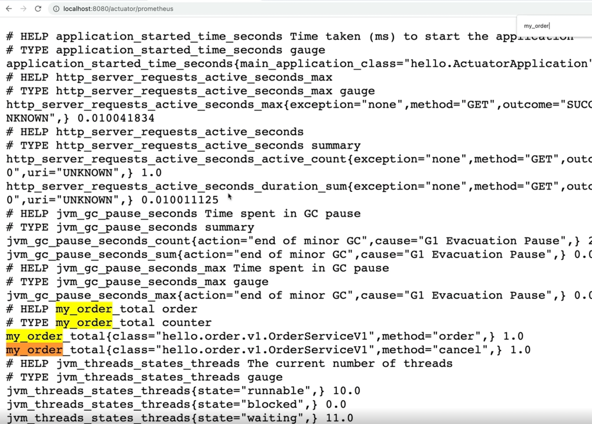

# spring-boot-monitoring-example
인프런 김영한님 스프링 부트 핵심 원리 활용 중 모니터링 메트릭 활용 연습 레포

## MeterRegistry 로 메트릭 등록하는 법

### Micrometer

- 마이크로미터가 메트릭에 대한 표준적인 방법을 제공
- 표준적인 counter 게이지 메트릭 등록
- 프로메테우스 포맷, 다른 모니터링 툴에 맞는 포맷으로 출력할 수 있게 함

### MeterRegistry
- 마이크로미터 기능을 제공하는 컴포넌트
- Spring 을 통해 주입 받아 사용

### Counter

- 단조롭게 증가하는 단일 누적 항목
  - 단일값
  - 보통 하나씩 증가함
  - 누적이므로 전체 값을 포함
- 값을 증가하거나 0으로 초기화 하는것만 가능
- 감소하는 것도 가능하지만 사용 목적에 맞지 않음

```java
import com.example.springbootmonitoringexample.order.OrderService;
import io.micrometer.core.instrument.Counter;
import io.micrometer.core.instrument.MeterRegistry;
import java.util.concurrent.atomic.AtomicInteger;
import lombok.RequiredArgsConstructor;
import lombok.extern.slf4j.Slf4j;

@Slf4j
@RequiredArgsConstructor
public class OrderServiceV1 implements OrderService {

    private final MeterRegistry meterRegistry;

    private AtomicInteger stock = new AtomicInteger(100);

    @Override
    public void order() {
        log.info("주문");
        stock.decrementAndGet();

        Counter.builder("my.order")
            .tag("class", this.getClass().getName())
            .tag("method", "order")
            .description("order")
            .register(meterRegistry).increment();
    }

    @Override
    public void cancel() {
        log.info("취소");
        stock.incrementAndGet();

        Counter.builder("my.order")
            .tag("class", this.getClass().getName())
            .tag("method", "cancel")
            .description("order")
            .register(meterRegistry).increment();
    }

    @Override
    public AtomicInteger getStock() {
        return stock;
    }
}
```
- Service 클래스에 `MeterRegistry` 주입
- Counter
  - `Builder("my.order")` : metric 이름
  - `tag("method", "order")` : 태그로 구분
    - order, cancel 태그로 구분하여 차트에 각각 그릴 수 있게됨
  - `increment()` : metric 값 증가
    - 메서드가 호출될 때마다 값이 1씩 증가

### 실행 확인

Spring application 을 실행하여 metric 을 확인해본다. (이때 모든 endpoint 를 보겠다는 actuator 설정이 켜져있어야함)
```yaml
management:
  endpoints:
    web:
      exposure:
        include: "*"
```

- 브라우저에서 `localhost:8080/actuator/metrics/my.order` 로 metric 확인
  - `my.order` 는 `Counter.builder()` 에 파라미터 값으로 넘겨준 그 값으로 확인한다
  - `builder` 에 지정해주는 값으로 metric 이 조회되지 않을 수 있다
    - 한 번이라도 호출이 있어야 확인이 가능
  - `my.order?tag=method:order` 와 같이 `tag` 를 이용하면 해당 tag 가 있는 메서드를 몇 번 호출됐는지 확인 할 수 있다

<br>

**프로메테우스로 확인** 


프로메테우스로 `my.order` 를 확인하면 위 이미지와 같다
- 여기서 `my.order` 가 `my_order` 로 명시된 걸 볼 수 있다
  - 프로메테우스는 `.` 을 `_` 로 변경한다
- `my_order_total`
  - `counter` 는 자동으로 `total` 이 붙는다

**그라파나로 확인**

시각화된 metric 을 볼 수 있다. Counter 는 계속 증가하기 때문에 특정 시간에 얼마나 증가했는지 보기 위해서는 `increase()`, `rate()` 와 같은 함수와 함께 사용하는 게 좋다.

## AOP로 metric 관리 로직 개선

`OrderServiceV1` 은 비즈니스 로직에 모니터링 메트릭 관리 로직이 섞여있다. AOP를 만들어서 이를 개선할 수 있지만 이미 `micrometer` 에서 제공해주고 있다.

### @Counted

```java
import com.example.springbootmonitoringexample.order.OrderService;
import io.micrometer.core.annotation.Counted;
import java.util.concurrent.atomic.AtomicInteger;
import lombok.extern.slf4j.Slf4j;

@Slf4j
public class OrderServiceV2 implements OrderService {

    private AtomicInteger stock = new AtomicInteger(100);

    @Counted("my.order")
    @Override
    public void order() {
        log.info("주문");
        stock.decrementAndGet();
    }

    @Counted("my.order")
    @Override
    public void cancel() {
        log.info("취소");
        stock.incrementAndGet();
    }

    @Override
    public AtomicInteger getStock() {
        return stock;
    }
}
```
- `@Counted` 어노테이션으로 기존에 `Counter.Builder` 로 만들어주던 걸 개선할 수 있다
  - 메서드에 @Counted 어노테이션으로 메트릭 이름을 지정하면 `tag` 에 method 를 기준으로 분류해서 적용해준다

```java
import com.example.springbootmonitoringexample.order.OrderService;
import io.micrometer.core.aop.CountedAspect;
import io.micrometer.core.instrument.MeterRegistry;
import org.springframework.context.annotation.Bean;
import org.springframework.context.annotation.Configuration;

@Configuration
public class OrderConfigV2 {

    @Bean
    OrderService orderService() {
        return new OrderServiceV2();
    }

    @Bean
    public CountedAspect countedAspect(MeterRegistry meterRegistry) {
        return new CountedAspect(meterRegistry);
    }

}
```
- Config에 `CountedAspect` 를 등록해야 @Counted 를 인지해서 AOP가 적용된다

이렇게 `AOP`를 이용해서 metric 관리 로직 비즈니스 로직에서 제거할 수 있다.

## 시간 측정 metric, Timer

Timer 는 시간을 측정하는데 사용된다. 실행 시간을 측정한다.
- Timer 는 다음과 같은 내용을 측정한다
  - `seconds_count` : 누적 실행 횟수
  - `seconds_sum` : 실행 시간의 합
  - `seconds_max` : 최대 실행 시간 (가장 오래 걸린 실행 시간)

`Counter.builder()` 를 사용하듯이 `Timer.builder()` 를 사용하여 생성한다. Timer 를 사용할 때는 `record()` 를 이용한다. `Timer.record()` 내부에 시간을 측정할 함수를 포함시켜주면 된다.
<br><br>

count, sum, max 와 같은 Timer metric 을 프로메테우스에서 다양하게 사용할 수 있다. 그 중에서 평균 실행 시간을 만들 수도 있는데, `seconds_sum` / `seconds_count` 는 평균 실행 시간을 볼 수 있다.

## Timer 로직 aop 로 개선

위에서 Counter 를 micrometer가 제공하는 aop로 개선해보았다. 이번에도 metric 관리 로직을 aop로 개선한다.

```java
import com.example.springbootmonitoringexample.order.OrderService;
import io.micrometer.core.annotation.Timed;
import java.util.Random;
import java.util.concurrent.atomic.AtomicInteger;
import lombok.extern.slf4j.Slf4j;

@Timed(value = "my.order")
@Slf4j
public class OrderServiceV4 implements OrderService {

    private AtomicInteger stock = new AtomicInteger(100);

    @Override
    public void order() {
        log.info("주문");
        stock.decrementAndGet();
        sleep(500);
    }

    private static void sleep(int time) {
        try {
            Thread.sleep(time + new Random().nextInt(200));
        } catch (InterruptedException e) {
            throw new RuntimeException(e);
        }
    }

    @Override
    public void cancel() {
        log.info("취소");
        stock.incrementAndGet();
        sleep(200);
    }

    @Override
    public AtomicInteger getStock() {
        return stock;
    }
}
```
- 클래스에 `@Timed` 어노테이션 사용
  - 메서드에도 사용 가능
- 클래스 내부에 존재하는 모든 `public` 메서드에 타이머가 적용됨

```java
import com.example.springbootmonitoringexample.order.OrderService;
import com.example.springbootmonitoringexample.order.v3.OrderServiceV3;
import io.micrometer.core.aop.TimedAspect;
import io.micrometer.core.instrument.MeterRegistry;
import org.springframework.context.annotation.Bean;
import org.springframework.context.annotation.Configuration;

@Configuration
public class OrderConfigV4 {

    @Bean
    OrderService orderService() {
        return new OrderServiceV4();
    }

    @Bean
    TimedAspect timedAspect(MeterRegistry meterRegistry) {
        return new TimedAspect(meterRegistry);
    }
}
```

타이머 또한 `TimedAspect` 를 적용해주어야 AOP 가 동작하게 된다.
