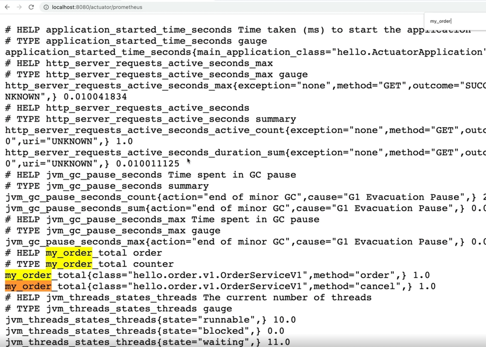

# spring-boot-monitoring-example
인프런 김영한님 스프링 부트 핵심 원리 활용 중 모니터링 메트릭 활용 연습 레포

## MeterRegistry 로 메트릭 등록하는 법

### Micrometer

- 마이크로미터가 메트릭에 대한 표준적인 방법을 제공
- 표준적인 counter 게이지 메트릭 등록
- 프로메테우스 포맷, 다른 모니터링 툴에 맞는 포맷으로 출력할 수 있게 함

### MeterRegistry
- 마이크로미터 기능을 제공하는 컴포넌트
- Spring 을 통해 주입 받아 사용

### Counter

- 단조롭게 증가하는 단일 누적 항목
  - 단일값
  - 보통 하나씩 증가함
  - 누적이므로 전체 값을 포함
- 값을 증가하거나 0으로 초기화 하는것만 가능
- 감소하는 것도 가능하지만 사용 목적에 맞지 않음

```java
import com.example.springbootmonitoringexample.order.OrderService;
import io.micrometer.core.instrument.Counter;
import io.micrometer.core.instrument.MeterRegistry;
import java.util.concurrent.atomic.AtomicInteger;
import lombok.RequiredArgsConstructor;
import lombok.extern.slf4j.Slf4j;

@Slf4j
@RequiredArgsConstructor
public class OrderServiceV1 implements OrderService {

    private final MeterRegistry meterRegistry;

    private AtomicInteger stock = new AtomicInteger(100);

    @Override
    public void order() {
        log.info("주문");
        stock.decrementAndGet();

        Counter.builder("my.order")
            .tag("class", this.getClass().getName())
            .tag("method", "order")
            .description("order")
            .register(meterRegistry).increment();
    }

    @Override
    public void cancel() {
        log.info("취소");
        stock.incrementAndGet();

        Counter.builder("my.order")
            .tag("class", this.getClass().getName())
            .tag("method", "cancel")
            .description("order")
            .register(meterRegistry).increment();
    }

    @Override
    public AtomicInteger getStock() {
        return stock;
    }
}
```
- Service 클래스에 `MeterRegistry` 주입
- Counter
  - `Builder("my.order")` : metric 이름
  - `tag("method", "order")` : 태그로 구분
    - order, cancel 태그로 구분하여 차트에 각각 그릴 수 있게됨
  - `increment()` : metric 값 증가
    - 메서드가 호출될 때마다 값이 1씩 증가

### 실행 확인

Spring application 을 실행하여 metric 을 확인해본다. (이때 모든 endpoint 를 보겠다는 actuator 설정이 켜져있어야함)
```yaml
management:
  endpoints:
    web:
      exposure:
        include: "*"
```

- 브라우저에서 `localhost:8080/actuator/metrics/my.order` 로 metric 확인
  - `my.order` 는 `Counter.builder()` 에 파라미터 값으로 넘겨준 그 값으로 확인한다
  - `builder` 에 지정해주는 값으로 metric 이 조회되지 않을 수 있다
    - 한 번이라도 호출이 있어야 확인이 가능
  - `my.order?tag=method:order` 와 같이 `tag` 를 이용하면 해당 tag 가 있는 메서드를 몇 번 호출됐는지 확인 할 수 있다

<br>

**프로메테우스로 확인** 


프로메테우스로 `my.order` 를 확인하면 위 이미지와 같다
- 여기서 `my.order` 가 `my_order` 로 명시된 걸 볼 수 있다
  - 프로메테우스는 `.` 을 `_` 로 변경한다
- `my_order_total`
  - `counter` 는 자동으로 `total` 이 붙는다

**그라파나로 확인**

시각화된 metric 을 볼 수 있다. Counter 는 계속 증가하기 때문에 특정 시간에 얼마나 증가했는지 보기 위해서는 `increase()`, `rate()` 와 같은 함수와 함께 사용하는 게 좋다.
